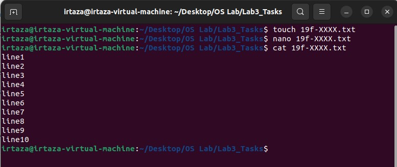
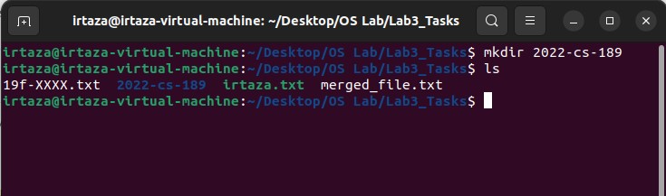

# Task1
# Q1
In this task I created a new file using **touch** command and write ten lines in it using **nano** command and then print it using **cat** command.

Using **nano** command i enter data in it like this:

# Q2
In this task I created another file using **touch** command and write ten lines in it using **nano** command and then print it using **cat** command.

Using **nano** command i enter data in it like this:

# Q3_4
In this task I **merged** the data of one file to another and then **redirect** the data to another file.

# Q5
In this task I print the top two lines of the file using **head -2** command.

# Q6
In this task I print the last two lines of the file using **tail -2** command.

# Q7
In this task I find the string **roll** from the file using **grep** command.

# Q8
In this task I grant permission to the group to execute the file using **chmod** command.

# Q9
In this task I remove permission to the owner to write the file using **chmod** command.

# Q10
In this task I type **pwd** to find the current directory path.

# Q11
In this task I list all the files and folders in the current working directory using **ls** command.

# Q12
In this task I made a new folder using **mkdir** command.

# Q13
In this task I print date and time using **date** command.

# Q14
In this task I print *Thank You* using **echo** command.

