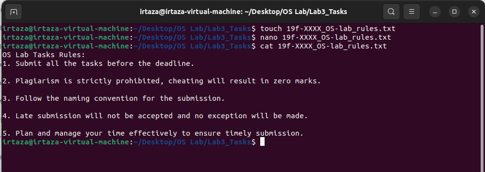
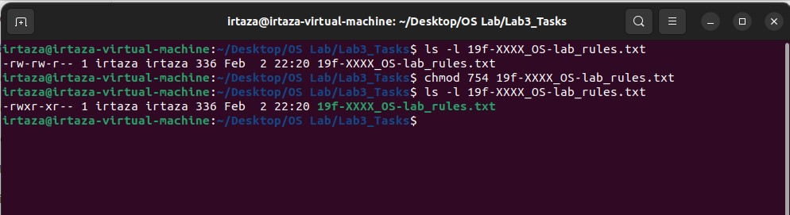
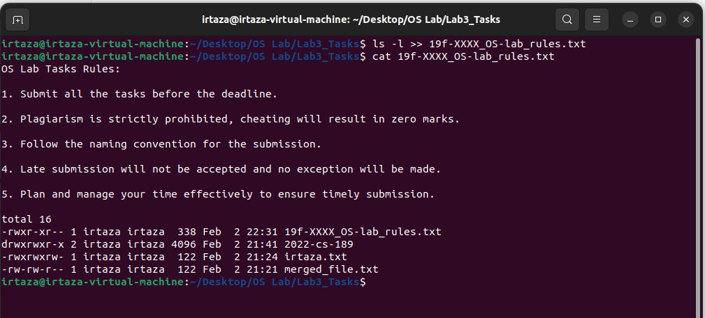

# Task2

# Q1
In this task I created a new file using **touch** command and write lab rules in it using **nano** command and then print those rules using **cat** command.

# Q2-3
In this task I set the rights of created file to *(- rwx r-x r--)* in numeric format using **chmod** command like this **chmod 754 filename.txt**.

# Q4
In this task I append the output of **ls** command in the created file using ** ls -l >> filename.txt**.

