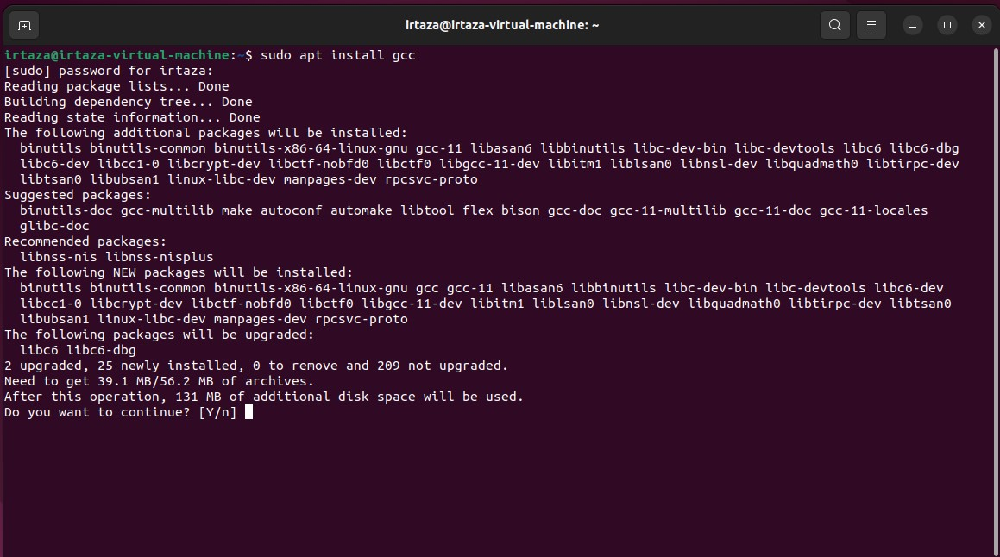

---

---

<h2 id="step-1-installing-gcc-compiler">Step 1: Installing gcc compiler</h2>

Open the terminal in Ubuntu and execute the following command to install the GCC compiler for the C language: 
<strong>"sudo apt install gcc"</strong> 
If prompted, type ‘y’ and press Enter to confirm the installation. 

<h2 id="step-2-write-code-in-c-language">Step 2: Write code in C language</h2>

Open a text editor and write a simple “Hello World” program in C. Save the file as  <strong>"code1.c"</strong>

<h2 id="step-3-run-your-code">Step 3: Run your code</h2>

In the terminal, convert your C code into an executable file named  <strong>“code1.exe”</strong>  using the following commands: 
<strong>"gcc code1.c -o code1.exe"</strong> 
Now run you file by writing the command. 
<strong>"./code1.exe"</strong> 
You should see the “Hello World” output.

<h2 id="step-4-installing-g-compiler">Step 4: Installing g++ Compiler</h2>

Open the terminal in Ubuntu and execute the following command to install the G++ compiler for the C++ language: 
<strong>"sudo apt install g++"</strong> 
If prompted, type ‘y’ and press Enter to confirm the installation. 

<h2 id="step-5-write-code-in-c-language">Step 5: Write code in C++ language</h2>

Open a text editor and write a simple “Hello World” program in C. Save the file as  <strong>“code.cpp”</strong>.

<h2 id="step-6-run-your-code">Step 6: Run your code</h2>

In the terminal, convert your C++ code into an executable file named  <strong>“code.exe”</strong>  using the following commands: 
<strong>"g++ code.c -o code.exe"</strong> 
Now run you file by writing the command. 
<strong>"./code.exe"</strong> 
You should see the “Hello World” output.

<h3 id="github-repository-link">Github Repository link</h3>

[<a href="https://github.com/Irtazamanzoor009/OS-Lab">https://github.com/Irtazamanzoor009/OS-Lab</a>]

